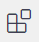
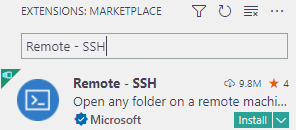
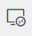
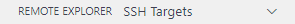
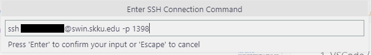
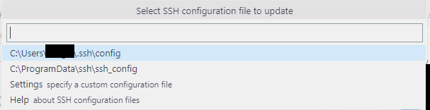
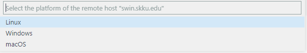
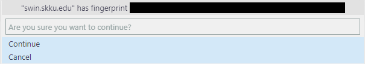
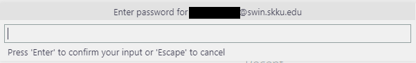

# VSCode - Remote SSH 연동

Visual Studio Code(이하 VSCode)는 다양한 플러그인을 활용할 수 있는 강력한 텍스트 에디터입니다. Mobaxterm을 대체하여 VSCode를 인의예지 서버와 연동하여 다양한 기능을 활용할 수 있습니다.


## 주의!!!!
현재 인의예지 서버가 리소스 부족으로 자주 고통받고 있습니다. VSCode-Remote의 구동 특성상 자원을 많이 잡아먹기 때문에 되도록 VSCode를 통해서 연결하는 것은 지양해주시길 당부드립니다. 향후 Windows에서 docker 혹은 WSL을 이용한 리눅스 개발 관련 글도 작성하겠습니다.


### 설치 방법
1. VSCode가 설치되지 않은 경우, [여기](https://code.visualstudio.com/)를 클릭하여 VSCode를 설치합니다.
2. VSCode를 켜고  아이콘을 클릭합니다.
3. 새로 열린 창에서 ```Remote - SSH```를 검색하고 나오는 플러그인을 설치합니다.
   

   


4. 왼쪽 상단  아이콘을 클릭합니다.
5. 위의 Remote Explorer가 SSH Target인지 확인합니다.
   
   

6. SSH TARGETS 옆에 있는 + 버튼을 클릭합니다.

   

7. 중앙 상단에 SSH Connection Command를 입력하라는 창이 뜹니다.<br>
   CLI에서 SSH 접속하듯이 입력해줍시다.
    
   

8. 연결 정보를 저장할 파일을 고르라는 창이 뜹니다. <br>
   잘 모르겠으면 맨 위를 선택합니다.

   
  
9.  왼쪽에 새로 추가된 모습을 볼 수 있습니다.
10. 이제 연결해봅시다. 방금 추가한 설정을 우클릭하고 'Connection to New Window'를 클릭합니다.
11. 먼저 접속하는 서버의 OS를 물어봅니다. Linux를 선택해줍시다.

    

12. 처음 접속하는 경우 known_host에 등록할지를 물어보는 경고가 뜹니다. Continue를 선택해줍시다.
    
    

13. 이제 비밀번호를 입력해야 합니다. 자기 계정의 비밀번호를 입력합시다.
    
    
14. ~~인고의~~ 설치시간이 지나면 준비가 완료됩니다!

    

